# Deploying a Highly Available Web Application on AWS

## Overview
This project demonstrates the deployment of a highly available and fault-tolerant web application on AWS. The architecture ensures resilience, scalability, and security by leveraging AWS resources such as EC2 instances, a load balancer, NAT Gateways, and a custom Virtual Private Cloud (VPC).
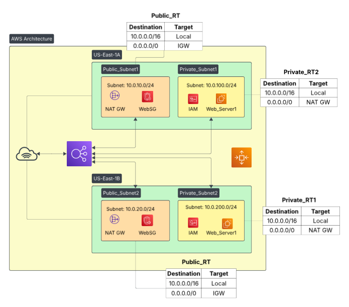

## Architecture Components
### 1. **Virtual Private Cloud (VPC) and Subnets**
- A custom VPC hosting both public and private subnets across two availability zones.
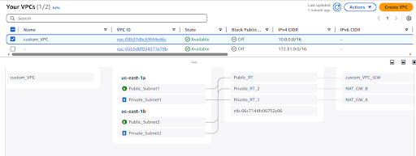
- **Public Subnets:** Hosts resources requiring internet access, such as the load balancer and NAT Gateways.
- **Private Subnets:** Hosts backend EC2 instances, ensuring security and isolation.
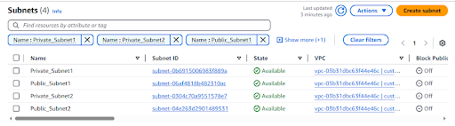

### 2. **Route Tables**
- Configured for both public and private subnets to manage traffic flow effectively.
#### **Public Subnets Route Table**
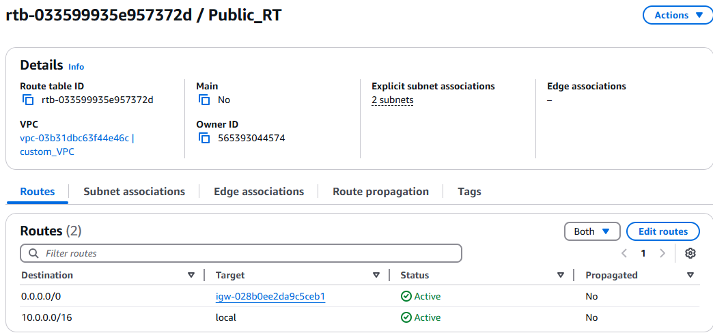

#### **Private Subnets Route Tables**
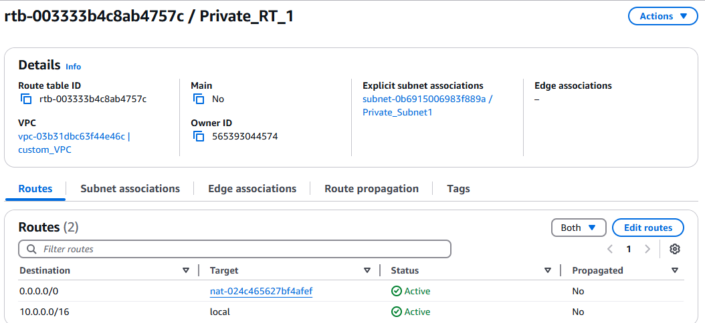
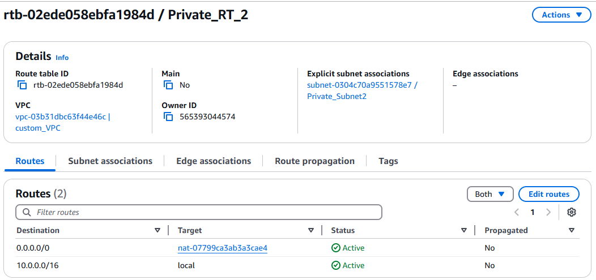

### 3. **Gateways**
- **Internet Gateway:** Allows communication between public subnets and the internet.
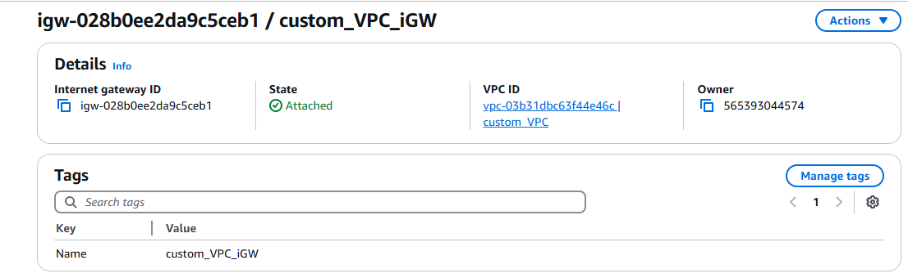

- **NAT Gateways:** Provides secure internet access for private subnets.
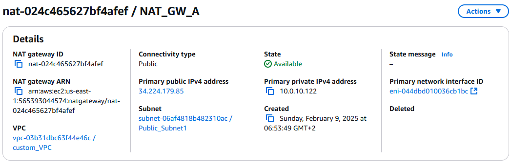
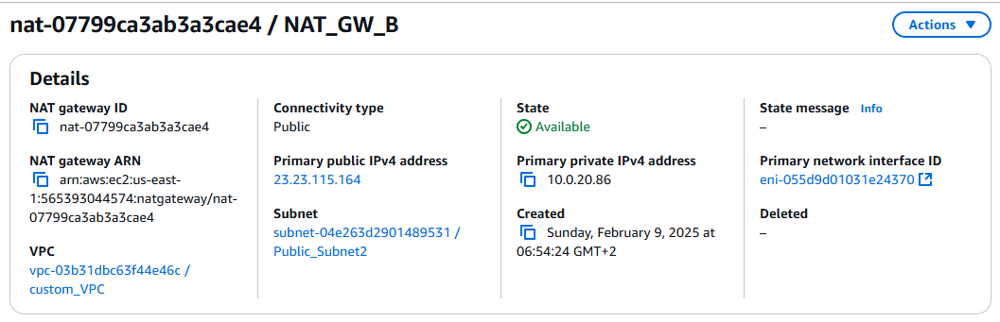

### 4. **EC2 Instances**
- Web application backend hosted on two EC2 instances (Web_Server1 and Web_Server2) in private subnets.
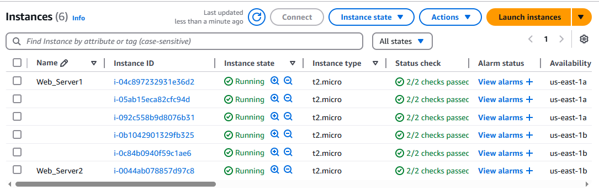
- Auto Scaling Groups (ASG) ensure elasticity by dynamically adjusting instances based on demand.
- IAM Roles assigned for secure access management.
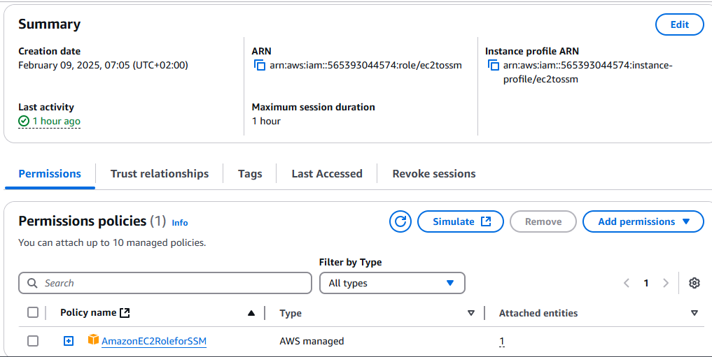

### 5. **Load Balancer**
- A highly available load balancer distributes incoming traffic across EC2 instances.
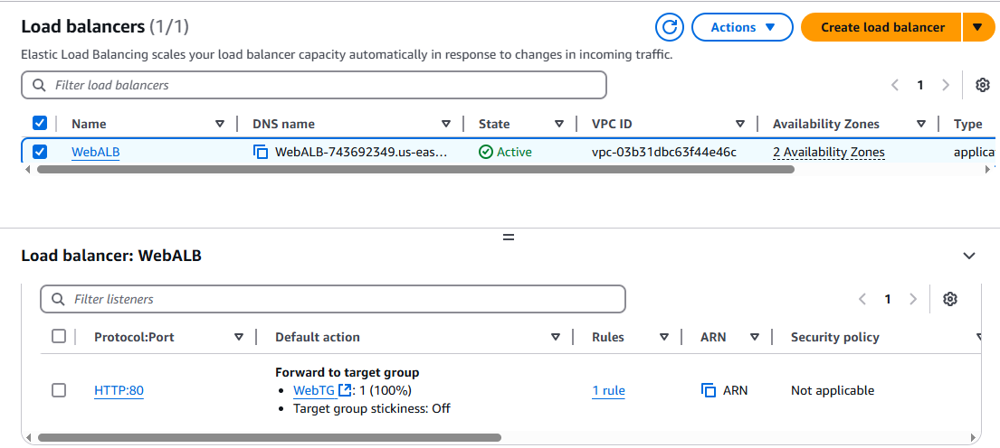
- Target groups are used for efficient traffic routing.
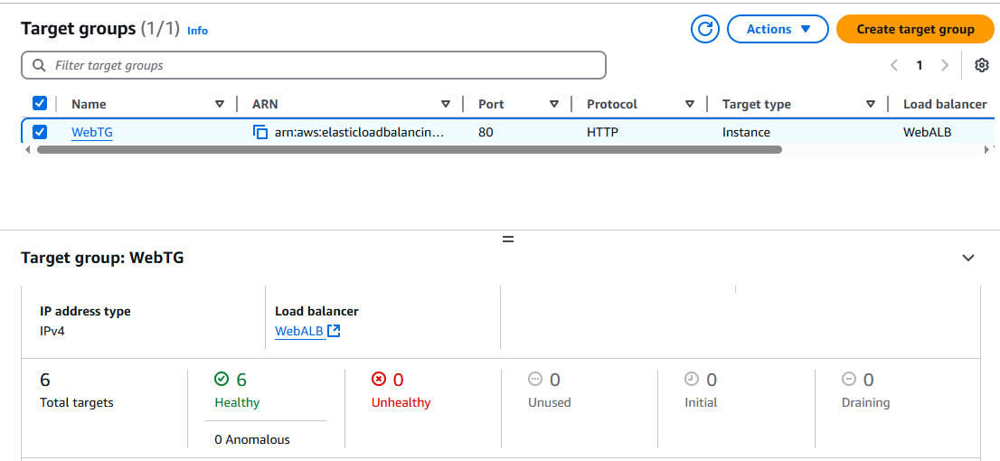

### 6. **Security Groups**
- Configured to enforce strict access controls and protect resources from unauthorized access.
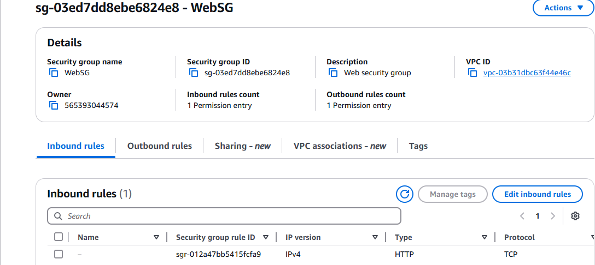
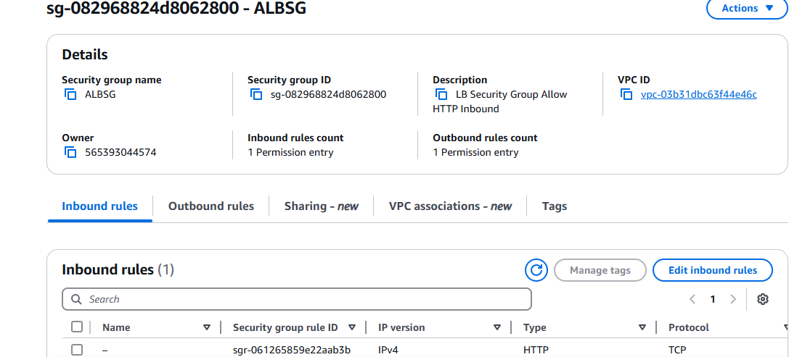