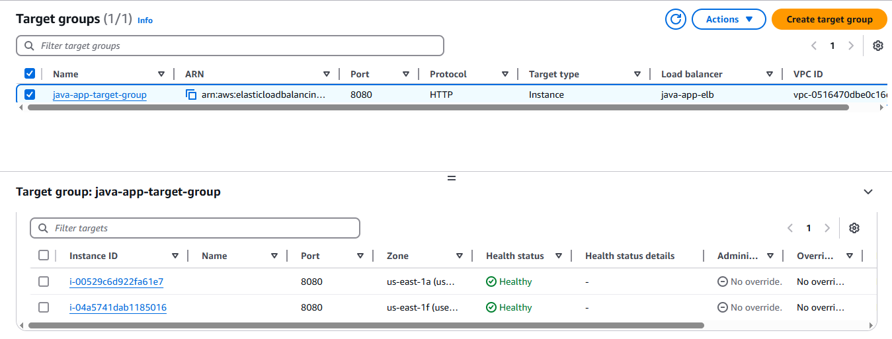

# Deploying a Highly Available Java Application on AWS
This project demonstrate my hands-on practice to deploy a Java Application on AWS using Rehosting Migration Strategy. There are many AWS services used in this application such as: EC2, S3, IAM, Auto Scaling, Elastic Load Balancer and Route 53. You can review the code of the deployed application in the following link: [Java App](https://github.com/hkhcoder/vprofile-project).

## 📌 Overview


---

## 🏗 Architecture Components
### 1️⃣ **Security Groups**
Starting by building the necessary security group required to manage the communication between the difference instances and services.

✅ #### **Elastic Load Balancer Security Group**
The load balance works as a proxy for the application. So, It should accept any incoming traffic on ports 80 (HTTP).


✅ #### **Tomcat Security Group**
The tomcat is the server hosting the java application. So, It accepts any traffic coming from the Elastic Load Balancer.


✅ #### **Backend Security Group**
This is the security group that manages the traffic to the running databases instances for MySQL, Memcache and RabbitMQ, either between the databases and the application or between the databases themselves.

---

### 2️⃣ **EC2-Instances**


✅ #### **MySQL EC2 Instance**
The user data Used to setup this instance
```
#!/bin/bash
DATABASE_PASS='admin123'
sudo dnf update -y
sudo dnf install git zip unzip -y
sudo dnf install mariadb105-server -y
# starting & enabling mariadb-server
sudo systemctl start mariadb
sudo systemctl enable mariadb
cd /tmp/
git clone -b main https://github.com/hkhcoder/vprofile-project.git
#restore the dump file for the application
sudo mysqladmin -u root password "$DATABASE_PASS"
sudo mysql -u root -p"$DATABASE_PASS" -e "ALTER USER 'root'@'localhost' IDENTIFIED BY '$DATABASE_PASS'"
sudo mysql -u root -p"$DATABASE_PASS" -e "DELETE FROM mysql.user WHERE User='root' AND Host NOT IN ('localhost', '127.0.0.1', '::1')"
sudo mysql -u root -p"$DATABASE_PASS" -e "DELETE FROM mysql.user WHERE User=''"
sudo mysql -u root -p"$DATABASE_PASS" -e "DELETE FROM mysql.db WHERE Db='test' OR Db='test\_%'"
sudo mysql -u root -p"$DATABASE_PASS" -e "FLUSH PRIVILEGES"
sudo mysql -u root -p"$DATABASE_PASS" -e "create database accounts"
sudo mysql -u root -p"$DATABASE_PASS" -e "grant all privileges on accounts.* TO 'admin'@'localhost' identified by 'admin123'"
sudo mysql -u root -p"$DATABASE_PASS" -e "grant all privileges on accounts.* TO 'admin'@'%' identified by 'admin123'"
sudo mysql -u root -p"$DATABASE_PASS" accounts < /tmp/vprofile-project/src/main/resources/db_backup.sql
sudo mysql -u root -p"$DATABASE_PASS" -e "FLUSH PRIVILEGES"
```

✅ #### **MemCache EC2 Instance**
The user data Used to setup this instance
```
#!/bin/bash
sudo dnf install memcached -y
sudo systemctl start memcached
sudo systemctl enable memcached
sudo systemctl status memcached
sed -i 's/127.0.0.1/0.0.0.0/g' /etc/sysconfig/memcached
sudo systemctl restart memcached
sudo memcached -p 11211 -U 11111 -u memcached -d
```

✅ #### **RabbitMQ EC2 Instance**
The user data Used to setup this instance
```
#!/bin/bash
## primary RabbitMQ signing key
rpm --import 'https://github.com/rabbitmq/signing-keys/releases/download/3.0/rabbitmq-release-signing-key.asc'
## modern Erlang repository
rpm --import 'https://github.com/rabbitmq/signing-keys/releases/download/3.0/cloudsmith.rabbitmq-erlang.E495BB49CC4BBE5B.key'
## RabbitMQ server repository
rpm --import 'https://github.com/rabbitmq/signing-keys/releases/download/3.0/cloudsmith.rabbitmq-server.9F4587F226208342.key'
curl -o /etc/yum.repos.d/rabbitmq.repo https://raw.githubusercontent.com/hkhcoder/vprofile-project/refs/heads/awsliftandshift/al2023rmq.repo
dnf update -y
## install these dependencies from standard OS repositories
dnf install socat logrotate -y
## install RabbitMQ and zero dependency Erlang
dnf install -y erlang rabbitmq-server
systemctl enable rabbitmq-server
systemctl start rabbitmq-server
sudo sh -c 'echo "[{rabbit, [{loopback_users, []}]}]." > /etc/rabbitmq/rabbitmq.config'
sudo rabbitmqctl add_user test test
sudo rabbitmqctl set_user_tags test administrator
rabbitmqctl set_permissions -p / test ".*" ".*" ".*"

sudo systemctl restart rabbitmq-server
```


✅ #### **Tomcat Server EC2 Instance**
1. The user data Used to setup this instance
```
#!/bin/bash
sudo apt update
sudo apt upgrade -y
sudo apt install openjdk-17-jdk -y
sudo apt install tomcat10 tomcat10-admin tomcat10-docs tomcat10-common git -y
```
2. Copying the WAR file from the S3 Bucket and adding it to the Tomcat Server files on the EC2 instance.

---

### 3️⃣ **Route 53**
A DNS is required to be used in the connection between the different services. So, it is a Hosted Zone DNS (Private).

---

### 4️⃣ **S3 Bucket**
Creating the S3 Bucket and uploading the war file of the java application into the bucket.

---

### 5️⃣ **IAM Users**
✅ #### **S3 Admin IAM User**
Access keys are used.


✅ #### **S3 Admin IAM Role**
It is used to allow the connection between the app01 EC2 instance and the S3 Bucket.


---

### 6️⃣ **Elastic Load Balancer**
✅ #### **Target Group**


✅ #### **ELB Configuration**


**Listener Configuration**


---
### 6️⃣ **Auto Scaler**
✅ #### **Launch Template**
1. **Creating an AMI for the Tomcat Server EC2 Instance**


2. Creating the Launch Template


✅ #### **Auto Scaler Configuration**
