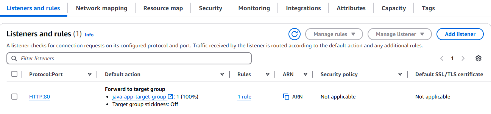

# Deploying a Highly Available Java Application on AWS

This project demonstrates the deployment of a Java application on AWS using the **Rehosting Migration Strategy**. Multiple AWS services are utilized, including EC2, S3, IAM, Auto Scaling, Elastic Load Balancer (ELB), and Route 53. The code for the deployed application can be accessed here: [Java App](https://github.com/hkhcoder/vprofile-project).

## 📌 Overview


---

## 🏗 Architecture Components

### 1️⃣ **Security Groups**
Security groups are configured to manage communication between instances and services.

✅ **Elastic Load Balancer Security Group**
The load balancer acts as a proxy for the application, accepting incoming traffic on port **80 (HTTP)**.


✅ **Tomcat Security Group**
The Tomcat server hosts the Java application and only accepts traffic from the Elastic Load Balancer.


✅ **Backend Security Group**
This security group regulates traffic for MySQL, Memcached, and RabbitMQ instances.


---

### 2️⃣ **EC2 Instances**


✅ **MySQL EC2 Instance**
User data script to set up the instance:
```bash
#!/bin/bash
DATABASE_PASS='admin123'
sudo dnf update -y
sudo dnf install git zip unzip -y
sudo dnf install mariadb105-server -y
sudo systemctl start mariadb
sudo systemctl enable mariadb
cd /tmp/
git clone -b main https://github.com/hkhcoder/vprofile-project.git
sudo mysqladmin -u root password "$DATABASE_PASS"
sudo mysql -u root -p"$DATABASE_PASS" -e "create database accounts"
sudo mysql -u root -p"$DATABASE_PASS" accounts < /tmp/vprofile-project/src/main/resources/db_backup.sql
```

✅ **Memcached EC2 Instance**
```bash
#!/bin/bash
sudo dnf install memcached -y
sudo systemctl start memcached
sudo systemctl enable memcached
sed -i 's/127.0.0.1/0.0.0.0/g' /etc/sysconfig/memcached
sudo systemctl restart memcached
sudo memcached -p 11211 -U 11111 -u memcached -d
```

✅ **RabbitMQ EC2 Instance**
```bash
#!/bin/bash
rpm --import 'https://github.com/rabbitmq/signing-keys/releases/download/3.0/rabbitmq-release-signing-key.asc'
dnf install -y erlang rabbitmq-server
systemctl enable rabbitmq-server
systemctl start rabbitmq-server
sudo rabbitmqctl add_user test test
sudo rabbitmqctl set_user_tags test administrator
rabbitmqctl set_permissions -p / test ".*" ".*" ".*"
sudo systemctl restart rabbitmq-server
```

✅ **Tomcat Server EC2 Instance**
1. Install dependencies:
```bash
#!/bin/bash
sudo apt update
sudo apt install -y openjdk-17-jdk tomcat10 git
```
2. Copy WAR file from S3 and deploy on Tomcat.

---

### 3️⃣ **Route 53**
A private **Hosted Zone DNS** is set up for internal service communication.


---

### 4️⃣ **S3 Bucket**
An S3 bucket stores the Java application WAR file for deployment.


---

### 5️⃣ **IAM Roles and Users**

✅ **S3 Admin IAM User**
An IAM user with S3 access keys is created.


✅ **S3 Admin IAM Role**
A role is assigned to the EC2 instance to allow S3 access.


---

### 6️⃣ **Elastic Load Balancer**

✅ **Target Group**


✅ **ELB Configuration**


✅ **Listener Configuration**


---

### 7️⃣ **Auto Scaling**

✅ **Launch Template**
1. **AMI Creation for Tomcat Server**

2. **Launch Template Configuration**


✅ **Auto Scaling Group Configuration**


---

## 🎉 Application is Live!
